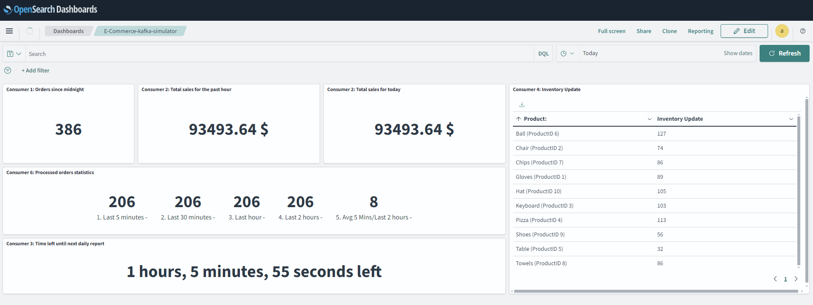

# E-Commerce Kafka Situlator

## Project Overview
The "E-Commerce Kafka Simulator" project is a simplified yet powerful tool designed to mimic the complex order management and data analysis activities seen in e-commerce businesses. It uses Apache Kafka to demonstrate how effectively data streaming can handle tasks like order processing, sales monitoring, inventory control, and report generation. Kafka's role in managing real-time data across distributed systems is a highlight of this project.

For ease of use and scalability, Kafka and Zookeeper are run inside Docker containers. The project outputs the results of data processing to both console and AWS OpenSearch for detailed analytics and live updates. This setup ensures users can easily track and analyze the simulated e-commerce operations in real-time.

## Features:
- Real-time Order Processing: Simulates the generation and processing of e-commerce orders in real-time.
- Sales Tracking: Tracks daily and hourly sales data, providing insights into sales trends.
- Inventory Management: Monitors inventory levels and automatically refills products based on predefined thresholds.
- Sales Reports: Generates daily sales reports, offering a comprehensive view of sales performance.
- Processing Statistics: Collects and summarizes processing statistics of orders, offering insights into the efficiency of order processing.
- Docker Integration: Utilizes Docker to containerize Zookeeper and Kafka services, ensuring easy deployment and scalability.

## Project Flow Chart
Below is a flow chart that demonstrates the Kafka-based event streaming architecture used for handling e-commerce orders. It illustrates how orders are produced, processed, and consumed by various services for tasks such as sales tracking, reporting, and inventory management.


## Prerequisites
- Python 3.10: The project is developed with Python 3.10, and using this version is necessary for compatibility.
- Docker: Required for running the Kafka and Zookeeper containers.
- Docker Compose: Used to define and run multi-container Docker applications.
- Other Dependencies: All other dependencies required by the project are listed in the `requirements.txt` file and can be installed via pip

## Installation Instructions
1. Clone the repository: `git clone [repository URL]`
2. Navigate to the project directory: `cd [project directory]`
3. This project is developed with Python 3.10. To ensure compatibility and proper functioning, it's important to set up a virtual environment using Python 3.10. Follow these steps:
    * Create a new virtual environment: `<path/to/python3.10> -m venv venv`
    * Activate the virtual environment: `venv\Scripts\activate` on Windows or `source venv/bin/activate` on Linux/macOS
4. Install the required dependencies: `pip install -r requirements.txt`
5. Run `docker-compose up -d` in terminal to pull the necessary Docker images and start the containers.


## Running the Simulation:
- Start the first producer: To begin generating and dispatching orders to the Kafka topic, open your console and execute the command `python kafka_producer.py`. This step activates the producer script, which is responsible for creating the simulation's order flow.

- Initialize the consumers and the second producer: Open another console window and run `python kafka_run_all_consumers.py`. This command launches all the consumer scripts and a second producer, working together to process the incoming orders.

 ### Integrating AWS OpenSearch for Analytics
 The project is configured to dispatch output to AWS OpenSearch, in addition to providing console output. Here’s a brief guide on setting up AWS OpenSearch and configuring the project to communicate with it:

#### AWS OpenSearch Setup:
- **Create an OpenSearch Domain**: Navigate to the AWS Management Console, find the OpenSearch Service, and create a new domain. Follow the setup wizard, choosing the instance and storage options that best fit your simulation needs.

- **Note Your Domain Endpoint**: Once the domain is active, note down the endpoint URL; you'll need it to configure your project.

#### Configuring Environmental Variables:
To connect your local simulation with AWS OpenSearch, you'll need to set environmental variables for the username, password, and endpoint of your OpenSearch domain.

- **Set Environmental Variables**: Create a `.env` file in your project directory and include the following lines, replacing placeholders with your actual OpenSearch domain details:
```
OPENSEARCH_USERNAME=your_opensearch_username
OPENSEARCH_PASSWORD=your_opensearch_password
OPENSEARCH_ENDPOINT=your_opensearch_endpoint
```
Once you've finished setting up, you'll have the option to configure a dashboard in AWS OpenSearch for live data visualization, similar to the example shown here:

