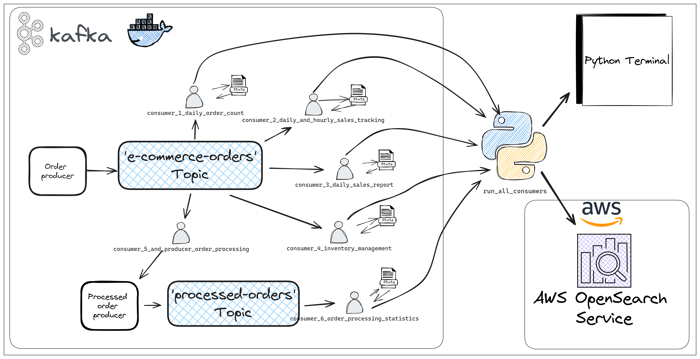

# E-commerce Kafka Event Streaming Flow Chart

Below is a flow chart that demonstrates the Kafka-based event streaming architecture used for handling e-commerce orders. It illustrates how orders are produced, processed, and consumed by various services for tasks such as sales tracking, reporting, and inventory management.

## Prerequisites

- Python 3.10
- Other dependencies listed in `requirements.txt`
