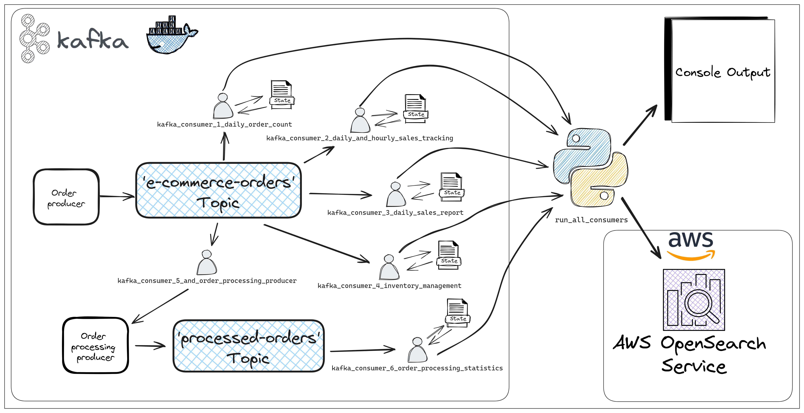

# E-Commerce Kafka Situlator

## Project Overview
The "E-Commerce Kafka Simulator" project is a simplified yet powerful tool designed to mimic the complex order management and data analysis activities seen in e-commerce businesses. It uses Apache Kafka to demonstrate how effectively data streaming can handle tasks like sales monitoring, inventory control, order processing and report generation. Kafka's role in managing real-time data across distributed systems is a highlight of this project.

#### Features:
* For ease of use and scalability, Kafka and Zookeeper are run inside Docker containers. 
* State management has been implemented to guarantee the safe restart of consumers without losing track of aggregated data, ensuring reliability and continuity in data processing. 
* The project allows for flexible output options, including the console, AWS OpenSearch, or both, based on user preference. This enables real-time tracking and analysis of the simulated e-commerce activities.

## Project Flow Chart
Below is a flow chart illustrating the project's Kafka-based architecture, highlighting the path of orders from production, through processing, to analysis.



#### Key Components:
* `kafka_order_producer`: Generates and sends simulated e-commerce orders to the Kafka topic, initiating the data flow for processing and analysis.
* `kafka_consumer_1_daily_order_count`: Monitors the number of orders placed during current day.
* `kafka_consumer_2_daily_and_hourly_sales_tracking`: Aggregates order data to compute daily and hourly sales figures.
* `kafka_consumer_3_daily_sales_report`: Compiles daily sales reports at midnight, summarizing order counts, sales totals, and product-specific performance. The report can then be found in the folder `./reports`
* `kafka_consumer_4_inventory_management`: Keeps track of inventory levels for each product. For the simplicity of the simulation, automatic restocking is implemented when supplies dip below predefined thresholds.
* `kafka_consumer_5_and_order_processing_producer`: Processes e-commerce orders randomly, simulates email notifications to customers, and logs details in `./reports/order_emails.txt`. Processed orders are sent to the 'processed-orders' topic.
* `kafka_consumer_6_order_processing_statistics`: Tracks and displays real-time statistics for processed orders across different time frames.
* `kafka_run_all_consumers`: The main entry point to initiate all consumer processes within the project, managing both console and AWS OpenSearch outputs.


## Prerequisites
- Python 3.10: The project is developed with Python 3.10, and using this version is necessary for compatibility.
- Docker: Required for running the Kafka and Zookeeper containers.
- Docker Compose: Used to define and run multi-container Docker applications.
- Other Dependencies: All other dependencies required by the project are listed in the `requirements.txt` file and can be installed via pip

## Installation Instructions
1. Clone the repository: `git clone [repository URL]`
2. Navigate to the project directory: `cd [project directory]`
3. This project is developed with Python 3.10. To ensure compatibility and proper functioning, it's important to set up a virtual environment using Python 3.10. Follow these steps:
    * Create a new virtual environment: `<path/to/python3.10> -m venv venv`
    * Activate the virtual environment: `venv\Scripts\activate` on Windows or `source venv/bin/activate` on Linux/macOS
4. Install the required dependencies: `pip install -r requirements.txt`
5. Run `docker-compose up -d` in terminal to pull the necessary Docker images and start the containers.

### Integrating AWS OpenSearch for Analytics
The project is configured to dispatch output to AWS OpenSearch, in addition to providing console output. Here’s a brief guide on setting up AWS OpenSearch and configuring the project to communicate with it:

#### AWS OpenSearch Setup:
- **Create an OpenSearch Domain**: Navigate to the AWS Management Console, find the OpenSearch Service, and create a new domain. Follow the setup wizard, choosing the instance and storage options that best fit your simulation needs.

- **Note Your Domain Endpoint**: Once the domain is active, note down the endpoint URL; you'll need it to configure your project.

#### Configuring Environmental Variables:
To connect your local simulation with AWS OpenSearch, you'll need to set environmental variables for the username, password, and endpoint of your OpenSearch domain.

- **Set Environmental Variables**: Create a `.env` file in your project directory and include the following lines, replacing placeholders with your actual OpenSearch domain details:
```
OPENSEARCH_USERNAME=your_opensearch_username
OPENSEARCH_PASSWORD=your_opensearch_password
OPENSEARCH_ENDPOINT=your_opensearch_endpoint
```


## Running the Simulation:
- Ensure Kafka and Zookeeper are active in Docker by using `docker-compose up -d`.
- To start order generation, run `python kafka_order_producer.py` in the console. This initiates the producer script for simulating order flow.

- To activate consumers and the secondary producer, use python `kafka_run_all_consumers.py` in a new console window. This triggers the processing scripts for orders and allows you to choose between console, AWS OpenSearch, or both for output display.

Upon setup, you can visualize data in real-time with AWS OpenSearch by creating a dashboard, as shown below:


For a simpler display, console output is also available:

